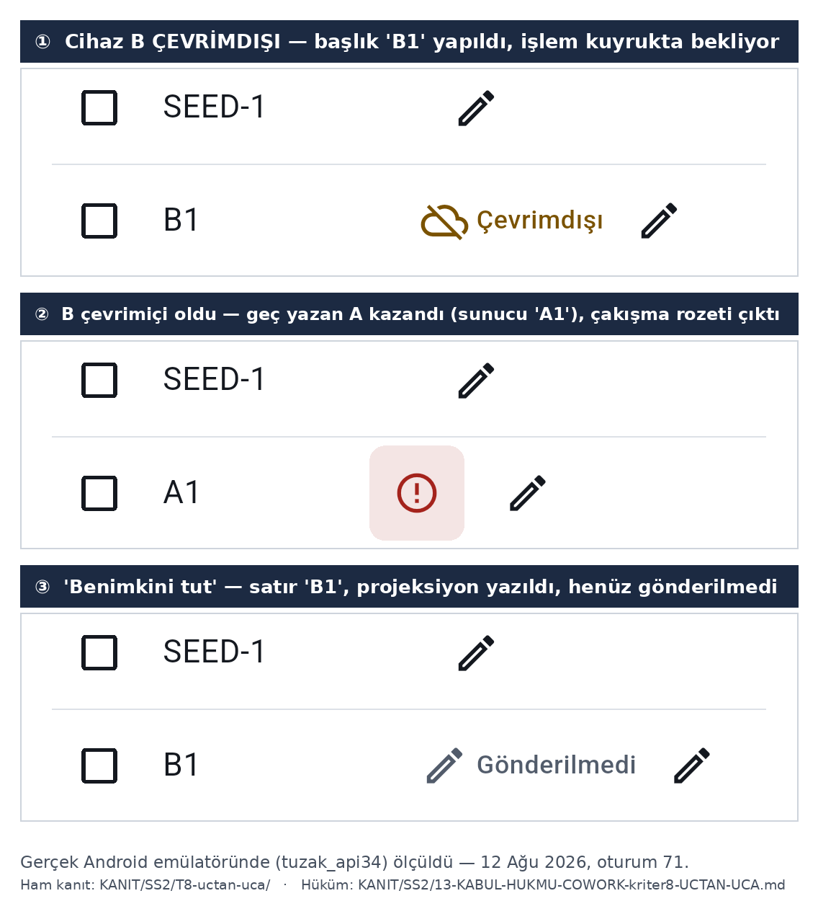

# Momentum

Çok platformlu görev yönetimi (to-do) uygulaması — **çevrimdışı-öncelikli senkron ve çakışma
çözümü** vitrinli, işe-alım/portfolyo ödevi olarak geliştirilen bir mimari çalışması.

**Flutter** istemci (Android + Web; iOS yalnız CI'da derlenir) · **N-katmanlı .NET 10 / ASP.NET Core**
backend · **PostgreSQL**.

🔴 **İlk cümlede ne YAZMADIĞIMA dikkat edin.** Ödevin ikinci vitrini olan **gerçek zamanlı
işbirliği TESLİM EDİLMEDİ**: sinyal kanalı (SignalR hub + outbox dispatcher) kodda ve testlerde
vardır, ama **çok kullanıcılı paylaşım/davet akışı yoktur** ve kimlik `devUserId` ile taşındığı
için işbirliği **gösterilemez**. Paketteki iki istemci (tarayıcı + telefon) sabit bir demo
kimliğiyle **aynı kullanıcıdır** — gördüğünüz şey işbirliği değil, **tek kullanıcının çok cihazlı
senkronu**. Kesilen maddelerin tamamı: [Kapsam dışı](#kapsam-dışı--teslim-beyanı).

> Bu depo bir ürün değil, bir **mühendislik disiplini** gösterimidir. Ayırt edici tarafı özellik
> listesi değil, **her iddianın ölçülmüş olması** ve ölçülemeyenin **açıkça ölçülemedi diye
> yazılmış** olmasıdır. Ayrıntı: [Ölçüm disiplini](#ölçüm-disiplini).

---

## Ne yapıyor

Görev **ekle** · **başlığını düzenle** · **tamamla** · **sil** (çöp ikonu → onay diyaloğu). Göreve
**öncelik** ve **son tarih** ver, ikisini de listede gör. **Etiket** ekle ve etikete göre **süz**
(çip şeridi). Görevlerini **başlıkta ara**. Hepsini tek satır **doğal dille** de ekleyebilirsin:
`#etiket`, `!p1` önceliği ve tarih ifadeleri metinden ayrışıp kendi alanlarına yazılır — ölçülmüş
örnek §Çalıştırma 0'dadır (`#is` ve `!p1` ayrıştı, görev PostgreSQL'e bu alanlarla ulaştı).

Tema, sistemin **açık/karanlık** ayarına uyar. Uygulama **internetsiz** çalışır, veri **kalıcıdır**,
bağlantı gelince **kendiliğinden eşitlenir**; iki cihaz aynı görevi değiştirirse **çakışma
kullanıcıya görünür** ve hangi değerin kazandığı anlaşılır.

🔴 **Ayrıştırıcının sınırları ölçülmüştür ve yazılıdır:** ASCII `yarin` ve büyük harfli `Yarın`
tanınmaz · saat başlıkta kalır · yılsız `03.01` geçmişe düşer · `#İş` ile `#iş` **ayrı**
etikettir (sunucu Ordinal karşılaştırır). Ayrıştırma satırın tamamını yutarsa **hata metni
gösterilmez**, metin alanda kalır — sessiz kayıp yoktur, geri bildirim de yoktur
([Beyan edilmiş sınırlar](#beyan-edilmiş-sınırlar)).

Yukarıdakilerin tamamı canlıdır (`CLAUDE.md` §2 bitti listesi **10/10**); kesilenler
[Kapsam dışı](#kapsam-dışı--teslim-beyanı) bölümündedir.

---

## Nasıl görünüyor

**Çevrimdışı yazım → çakışma → kullanıcının kararı.** Vitrin bu: bağlantı yokken yazılan bir
değişiklik kuyrukta bekler, bağlantı gelince sunucudaki değerle **çakışır**, çakışma kullanıcıya
**görünür** ve kararı kullanıcı verir.



Üç kare de **gerçek Android emülatöründe** koşan uygulamanın ekran görüntüsünden **kırpılmıştır**;
montaj, yeniden çizim ya da düzeltme yoktur. Kazananı **HLC** belirledi: A, B'den **225.739 ms
sonra** yazdı ve alan-seviyesi LWW A'yı korudu; *Benimkini tut* yeni ve daha geç bir HLC ile yazıp
sunucuya ulaştı (`tasks.title` ⇒ `B1`, PostgreSQL'den ölçüldü).

🔴 **Bu akışın ölçülmeyen tek ayağı var ve yazılıdır:** çakışma çözüm ekranının *canlı cihazdaki*
görüntüsü yakalanmadı (iki değerin aynı anda gösterildiği `G34/b` widget testiyle, mutantla ölçülü).
Ayrıntı: `KANIT/SS2/13-KABUL-HUKMU-COWORK-kriter8-UCTAN-UCA.md` §3.

### Canlı demo (yalnız istemci)

**https://tuzakavcisi1-cloud.github.io/Momentum/** — GitHub Pages; `.github/workflows/pages.yml`
ile dağıtılır (elle tetiklenir, `workflow_dispatch`).

Ekleyin · başlığı düzenleyin · tamamlayın · sayfayı yenileyin: **veri durur.**

🔴 **İki sınır ölçülmüştür ve gizlenmemiştir** (14 Ağu 2026, gerçek tarayıcı; ham ölçüm
`KANIT/o71/16-pages-demo/07-canli-olcum-COWORK.md`):

1. **Çapraz-köken izolasyon YOK.** GitHub Pages COOP/COEP başlığı gönderemez ⇒ ölçüm birebir:
   `crossOriginIsolated === false`, `SharedArrayBuffer` tanımsız ve drift OPFS yerine
   `sharedIndexedDb` seçiyor — konsolda
   `chosenImplementation=WasmStorageImplementation.sharedIndexedDb missingFeatures={dedicatedWorkersInSharedWorkers, sharedArrayBuffers}`.
   Bu, [Zorunlu şartlar](#zorunlu-şartlar) bölümünün 1. maddesindeki
   `crossOriginIsolated === true` ölçümünü **çürütmez**: o ölçüm §Çalıştırma 4'ün kurulumuna
   (istemciyi API ile **aynı kökenden** sunmak) aittir. Bayrak **gereklidir, yeterli değildir**.
2. **Backend YOK ⇒ senkron düşer.** Yazılan her satır kuyrukta bekler ve satırda
   *"↑ Gönderiliyor"* rozeti kalır; uygulama **kilitlenmez**, hata ekranı çıkmaz
   (ölçüldü: 21 konsol kaydı, **0 hata**). Gerçek zamanlı sinyal web'de zaten kapalıdır:
   `[sinyal] web: gercek zamanli sinyal KAPALI (K79/2) -- elle yenileme tek yol`.

Demo, vitrinin **çevrimdışı yarısını** gösterir; senkron ve çakışma çözümü yukarıdaki ölçülmüş
görselle ve `KANIT/SS2/` altındaki ham kayıtlarla temsil edilir.

🔴 **Demo, `--no-web-resources-cdn` şartını mekanik olarak zorlar:** iş akışı, build çıktısında
`"useLocalCanvasKit":true` **varlığını** ve derlenmiş uygulama kodunda CDN adresinin
**yokluğunu** ölçer; ikisinden biri düşerse yayın **yapılmaz**. Kapının kör olmadığı **beş
mutantla** kanıtlandı (`KANIT/o71/16-pages-demo/01-mutant-kosumlari.txt`).

---

## Depo haritası — nereden başlamalı

🔴 **Bu depo alışılmadık bir bileşim taşır ve bu bilinçlidir.** İzlenen dosyaların **%74'ü**
(1.355 / 1.821) ürün kodu değil, **ölçüm kanıtıdır**. Ne aradığınıza göre:

| ne arıyorsanız | nereye bakın |
|---|---|
| **Ürün kodu** | `src/backend/` (.NET, 4 katman) · `src/client/lib/` (Flutter) |
| **Testler** | `tests/` (backend, **127** test) · `src/client/test/` (istemci, **708** test) |
| **Mimari kararlar** | [`docs/ADR/`](docs/ADR/) |
| **Kapsam otoritesi** | [`docs/ODEV.md`](docs/ODEV.md) — neyin istendiği; kesilenler [Kapsam dışı](#kapsam-dışı--teslim-beyanı) |
| **Ölçüm araçları** | `araclar/` — CI'nın koştuğu `verify.ps1` + bağımlılık/yayın araçları; oturum kapıları `arsiv/araclar/` altına alındı (14 Ağu 2026) |
| **Ham ölçüm kanıtları** | `KANIT/` — **1.355 izlenen dosya, 16,3 MiB** (`311b6d0`'da sayıldı, 17 Ağu 2026) |
| **Esaslar ve durum** | `CLAUDE.md` (tek talimat dosyası) · `DURUM.md` (canlı durum) · süreç tarihçesi `arsiv/` |

**`KANIT/` nedir:** her kabul hükmünün, her düşmüş denetimin ve her mutant koşumunun **ham
çıktısı**. Dosya adları arasında `…-DENETIMDE-DUSTU…`, `…-KILITLENEMEDI…` gibi kayıtlar görürsünüz —
bunlar **temizlenmemiştir ve bilerek durmaktadır**: bir spec'in üç kez düşmesi, bu deponun
gizlediği değil **belgelediği** bir olgudur.

---

## Bir bakışta

| katman | ne yapar |
|---|---|
| `src/backend/Momentum.Domain` | saf alan modeli; dış bağımlılığı yok |
| `src/backend/Momentum.Application` | CQRS (Mediator), doğrulama, işlem davranışı |
| `src/backend/Momentum.Infrastructure` | PostgreSQL kalıcılığı, outbox dağıtıcısı |
| `src/backend/Momentum.Api` | kompozisyon kökü: uç noktalar, SignalR hub'ı, sağlık, OpenAPI/Scalar |
| `src/client` | Flutter: Drift ile çevrimdışı CRUD (ekle · **başlık düzenle** · tamamla · sil) + öncelik/son tarih, etiket ve etikete göre süzme, başlıkta arama, doğal dil ayrıştırma; itme kuyruğu, çekme, çakışma rozeti. Silme **arayüzde tetiklenir**: çöp ikonu → onay diyaloğu → `silindi` tombstone; canlı ölçümü ve iptal ayağının sınırı [Beyan edilmiş sınırlar](#beyan-edilmiş-sınırlar) bölümündedir. |

**Senkron:** çift yönlü — yerel yazma → itme kuyruğu → `POST /v1/sync`; sunucu tarafında outbox +
imleç tabanlı çekme (snapshot/artımlı, `hasMore`). Çakışma çözümü yerel LWW + kullanıcıya görünür
rozet. **Gerçek zamanlı:** SignalR üzerinden **yüksüz sinyal** (veri taşımaz, yalnız "çek" der).

---

## Çalıştırma

İki yol var: **değerlendirici yolu** (tek komut) ve **geliştirici yolu** (elle, parça parça).

### 0. Tek komut — değerlendirici yolu

```bash
docker compose up --build     # → http://localhost:5298
```

Bu tek komut şunu kurar: `postgres` → sağlıklı olunca `migrator` (EF migration paketi şemayı kurar
ve **çıkar**) → `api` (backend **ve** Flutter web istemcisi **aynı kökenden**). Tarayıcıda
`http://localhost:5298` adresini açtığınızda uygulamanın **backend'li** hâlini görürsünüz — Pages
demosundan farkı budur: orada backend yoktur, yazılan her satır kuyrukta kalır ve rozet
*"↑ Gönderiliyor"*da asılı durur (17 Ağu 2026, canlı demoda ölçüldü).

**Şema uygulamayı değil ayrı bir servis kurar.** Uygulamanın kendi şemasını değiştirmesi üretimde
anti-desendir; `api`, `migrator`'a `service_completed_successfully` ile bağlıdır.

**Bu iddiayı bir kapı ölçer.** `.github/workflows/paket.yml` her ilgili push'ta
GitHub-barındırmalı runner'da tam olarak bu komutu koşar ve şunları sınar:

| ayak | ne ölçülür |
|---|---|
| migrator | çıkış kodu **0** *ve* şemanın **sekiz ana tablosu adıyla** yerinde (`tasks`, `task_lists`, `task_tags`, `outbox_messages`, `processed_operations`, `sync_scalar_meta`, `sync_orset_tags`, `sync_orset_removes`) |
| 1 | `flutter_bootstrap.js` **gerçekten iner**, içinde `"useLocalCanvasKit":true` vardır ve `main.dart.js` **>100 KB** iner — yani derlenmiş uygulama imajın içindedir |
| 2 | **COOP `same-origin` + COEP `require-corp` + CORP `same-origin` istemci BELGESİNE değer** |
| 3 | `POST /v1/sync` başlıksız **401**, `X-Momentum-Dev-User` ile **200** |
| 4 | `GET /v1/tasks` **200** — ürün okuma ucu gerçekten çalışıyor |
| 5 | `GET /v1/BULUNMAYAN-UC` **404** döner, `index.html` **dönmez** |

🔴 **Bu kapının ilk sürümü KÖRDÜ ve bunu bağımsız bir denetim ölçerek gösterdi (16 Ağu 2026).**
Kayıt temizlenmiyor, çünkü bu deponun sözleşmesi bu: ilk sürümde AYAK 1, servis edilen gövdede
`flutter_bootstrap.js` **dizesini** arıyordu — o dize `src/client/web/index.html` şablonunda zaten
duruyor. Denetçi `Istemci:KokDizin`e **yalnız `index.html`** koyup API'yi kaldırdı: Flutter
çıktısının tamamı **404** dönerken dört ayak da **yeşil** yandı. Aynı denetim, migrator eşiğinin
(`≥3 tablo`) yarım uygulanmış bir şemayı geçirdiğini de ölçtü: `tasks` ve `task_lists` hiç
oluşmadan kapı geçiyor, sonra `GET /v1/tasks` **500** veriyordu. Yukarıdaki sürüm ikisini de
kapatır — dize değil **varlık** çekilir, sayı değil **ad** sorulur, ve **ürün ucu** çağrılır.

🟢 **Paket, gerçek bir makinede canlı ölçüldü** (17 Ağu 2026, Windows + Docker Desktop + Chrome;
ham kayıt `KANIT/o79/02-paket-CANLI-olcum-degerlendirici-makinesi.md`):

- `crossOriginIsolated === **true**` ve `SharedArrayBuffer` **tanımlı** ⇒ aynı kökenden sunmak
  izolasyonu **fiilen** üretiyor. Pages demosunda bu değer `false`'tur.
- Depolama seçimi konsoldan birebir: `chosenImplementation=WasmStorageImplementation.**opfsLocks**`
  — Pages'te aynı satır `sharedIndexedDb` der. İzolasyon başlıklarının somut karşılığı budur.
- Tarayıcıya `yarin 17:00 paket denemesi #is !p1` yazıldı; `GET /v1/tasks` **200** döndü ve görevi
  `priority: 1`, `tags: ["is"]` ile geri verdi ⇒ **istemcide yazılan satır PostgreSQL'e ulaştı**.
  Bu ayak Pages demosunda ASLA ölçülemez.

⏱ **İlk koşum maliyeti (ölçüldü, gizlenmiyor): 1639,7 sn ≈ 27 dakika.** Bunun 574 saniyesi
Flutter arşivinin (1,54 GB) indirilmesidir; ayrıca `sdk:10.0.302` (185 MB), `aspnet:10.0.11` ve
`postgres:17-alpine` iner. **Her iki .NET taban imajı da birebir pinlidir, yüzen etiket yoktur**
(17 Ağu 2026'da ölçüldü: yüzen `10.0` o an `10.0.11` veriyordu, komşu `10.0.10` da yayındaydı ⇒
etiket bandı atlayabilirdi; ham ölçüm `KANIT/o81/01-aspnet-pin-olcumu.txt`). CI'da aynı yapı 2,5 dk sürer (hızlı ağ, Docker Desktop katmanı yok).
**İkinci koşum katmanlardan gelir ve saniyeler alır.**

🔴 **Üç sınır beyan edilmiştir, gizlenmemiştir:**

1. İmaj `ASPNETCORE_ENVIRONMENT=Development` ile koşar — dev-kimlik kalkanı yalnız orada
   devrededir; başka her ortamda varsayılan-ret **her isteği 401'e düşürür**. Kimlik dilimi
   kapsam dışıdır (aşağıda [Kapsam dışı](#kapsam-dışı--teslim-beyanı)).
2. Web istemcisi kendi kökenini **derleme zamanında** öğrenir. Yayınlanan portu değiştirirseniz
   `SENKRON_SUNUCU_URL` yapı argümanını da değiştirmelisiniz, yoksa tarayıcıdaki istemci API'yi
   bulamaz.
3. `api` servisinde **healthcheck yoktur**: `aspnet` taban imajında `curl`/`wget` bulunmaz ve
   sırf yoklama için imaja araç eklemek çalışma yüzeyini büyütür. Hazırlık dışarıdan ölçülür:
   `curl -fsS http://localhost:5298/health/ready`.

### 1. PostgreSQL (geliştirici yolu)

```bash
docker compose -f docker-compose.yml -f docker-compose.gelistirme.yml up -d postgres
docker ps                       # healthy görünene kadar YOKLA, sabit sleep verme
```

> **Örtü dosyası neden gerekli:** ana `docker-compose.yml` **5432'yi yayınlamaz** — değerlendiricinin
> makinesinde çalışan bir PostgreSQL varsa tek-komut yolu, uzun bir derlemeden *sonra* port
> çakışmasıyla düşerdi. Tek-komut yolunun porta ihtiyacı yoktur (servisler compose ağında
> `postgres` adıyla konuşur); ama `dotnet run`'ı host'ta koşturan geliştirici ister. Port doluysa:
> `POSTGRES_PORT=5433 docker compose -f ... up -d postgres`.
>
> Servis adı **verilmezse** `docker compose up -d` tüm sistemi (postgres + migrator + api) kaldırır.
> Elle backend koşturacaksanız yalnız `postgres` isteyin, yoksa 5298 portu çakışır.
>
> **Parolayı sonradan değiştirirseniz:** `postgres` imajı `POSTGRES_PASSWORD`u yalnız **boş veri
> dizininde** uygular. Volume duruyorken parola değiştirmek kimlik doğrulama hatası verir; çare
> `docker compose down -v` (veriyi siler).

### 2. Backend

Bağlantı dizesi **repoda yoktur** (kırmızı çizgi 1: sırlar repoya girmez). Ortamdan verilir:

```powershell
cd src\backend\Momentum.Api
$env:ASPNETCORE_ENVIRONMENT = "Development"     # yoksa her istek 401 döner (dev-kimlik kalkanı)
$env:ASPNETCORE_URLS        = "http://0.0.0.0:5298"
$env:ConnectionStrings__Momentum = "Host=localhost;Port=5432;Database=momentum;Username=momentum;Password=<parola>"
dotnet run
```

> 🔴 **Bağlantı dizesi verilmezse host yine açılır ve port dinler** — ama Postgres'e hiç bağlanmaz.
> Hazır olmayı **portla ölçmeyin**; şu üçlüyü ölçün: `/health/live` **200** · `/health/ready`
> **200** · `POST /v1/sync` başlıksız **401**, `X-Momentum-Dev-User: <guid>` ile **200**.

### 3. Web istemcisi

```bash
cd src/client
flutter build web --release --no-web-resources-cdn
```

> 🔴 **`--no-web-resources-cdn` BİR TERCİH DEĞİL, ŞARTTIR.** Gerekçesi aşağıda
> [Zorunlu şartlar](#zorunlu-şartlar) bölümünde; **ölçülmüştür**, tercih değildir.

### 4. İstemciyi API ile aynı kökenden sun

```powershell
$env:Istemci__KokDizin = "<repo>\src\client\build\web"
```

Bu anahtar **boşsa** statik servis ara katmanı **hiç kurulmaz** (kill switch bedavadır). Ayarlıysa
`http://localhost:5298/` uygulamayı açar ve belge **çapraz-köken izole** olur.

### 5. Doğrulama zinciri

```powershell
.\araclar\verify.ps1          # build + test + CVE denetimi
```

> 🔴 **`verify.ps1`, çalışan bir `Momentum.Api` varken KOŞULAMAZ** — çalışan süreç `bin\` altındaki
> dll'leri kilitler ve derleme `MSB3026`/`MSB3027` ile düşer. Sıra: **cihaz/canlı kanıt → backend
> KAPAT (`netstat -ano | findstr :5298` boş dönmeli) → `verify.ps1`.**

**Son ölçüm (13 Ağu 2026, Windows, `araclar\verify.ps1`, gerçek PostgreSQL):**
`verify.ps1` ⇒ **EXIT 0** · derleme **0 uyarı / 0 hata** (`TreatWarningsAsErrors=true`) ·
**127/127 test geçti** (5 mimari · 44 SyncCore · 22 API · 56 kalıcılık) · **CVE kapısı: 0 zafiyetli
paket**. 🟢 Zincir bu kez **Windows'ta koştu** — önceki sürümlerde yalnız Linux konteynerde
ölçülmüştü. Ham çıktı: `KANIT/o71/15-verify-CVE-pin-sonrasi.txt`.

**İstemci, son ölçüm (17 Ağu 2026, Flutter 3.44.6 / Dart 3.12.2):**
`flutter test` ⇒ **708/708 geçti** · `flutter analyze` ⇒ **0 uyarı**.
Ölçümü **üreten el değil** bağımsız bir el koşar; o68 turunda **beş mutant** koşuldu
(erişilebilirlik etiketi ×2, düzen aritmetiği ×3) — **beşi de ısırdı**, ölü mutant yok.
Kanıt: `KANIT/SS2/05-KABUL-HUKMU-COWORK-o68-baslik-duzenleme-UI.md`.

🟢 **Widget testi artık tek ayak değil (17 Ağu 2026).** o79-o80'de paket **gerçek bir makinede**
koştu ve **çift yönlü senkron iki gerçek istemcide** kanıtlandı: masaüstü tarayıcı ↔ **gerçek
Android telefon**. Aynı turda telefonda bir düzen kusuru bulundu (boş senkron rozeti satırın
yarısını yutuyordu), düzeltildi ve **yine gerçek telefonda** doğrulandı: başlığın çizilen genişliği
**~225 px → ~450 px**. Ham kayıt: `KANIT/o79/`, `KANIT/o80/`.
🔴 **Hâlâ ölçülmeyen:** çakışma çözüm ekranının canlı cihazdaki görüntüsü (widget testiyle,
mutantla ölçülü) · erişilebilirlik duyurularının gerçek ekran okuyucuyla dinlenmesi
(§Beyan edilmiş sınırlar).

---

## Teslim paketi

📦 **Hazır paket: [Releases → `v1.0.1`](https://github.com/tuzakavcisi1-cloud/Momentum/releases/latest)** (Latest)
— derlenmiş Android APK (`momentum-v1.0.1-emulator.apk`, **59.953.218 bayt**), sha256'sı ve
imza/kimlik uyarılarıyla birlikte yayında; derlendiği commit `a332b25`. Aşağıdaki bölüm, paketi
**kendiniz derlemek** istediğinizde geçerlidir.

> `v1.0.0` arşiv olarak durur ve **dokunulmamıştır** — kendi kaynağıyla tutarlıdır. Ama orada
> uygulamanın görünen adı hâlâ `client`tır ve çalışma imajı yüzen `aspnet:10.0` etiketindedir;
> `v1.0.1` tam olarak bunları kapatır. **Değerlendirici `v1.0.1`'i indirmelidir.**

Paket iki parçadır: **çalışan sistem** (docker imajı — API + web istemcisi) ve **Android APK**.

**Windows'ta uygulama tarayıcıdan çalışır.** `docker compose up --build` Windows'ta da aynı tek
komuttur; değerlendirici `http://localhost:5298`'i Edge/Chrome'da açar ve backend'li tam uygulamayı
kullanır. **Yerel bir Windows masaüstü `.exe`'si yoktur** — Flutter'ın Windows masaüstü hedefi bu
depoya hiç eklenmedi (`src/client/` altında yalnız `android`, `ios`, `web` vardır; ölçüldü).
Kapsam kararıdır, aşağıda [Beyan edilmiş sınırlar](#beyan-edilmiş-sınırlar) bölümünde de yazılıdır.

### Paylaşılan kimlik — atlanırsa vitrin çıkmaz

İstemci kimliği (`devUserId`) **kurulum başına rastgele** üretilir. İki istemcinin birbirini
görmesi için ikisi de **aynı** `DEV_USER_ID` ile derlenmelidir; `docker-compose.yml` bu yüzden
sabit bir demo kimliği verir. **APK ve Windows derlemesinde aynı değeri verin**, yoksa telefon
ile tarayıcı iki ayrı kullanıcı olur ve senkron/çakışma vitrini görünmez.

```
DEV_USER_ID = deadbeef-0000-4000-8000-000000000001
```

> `DEV_USER_ID` mevcut kimlikten farklıysa ilk açılışta yerel görevler **ve** senkron kuyruğu
> aynı transaction'da silinir (bilinçli: eski kullanıcının bekleyen op'ları yeni kimlikle
> sunucuya itilmesin). GUID biçiminde olmayan bir değer **gürültülü hata** verir.

### Android APK

```bash
cd src/client
flutter build apk --release \
  --dart-define=SENKRON_SUNUCU_URL=http://<makinenin-LAN-IPsi>:5298 \
  --dart-define=DEV_USER_ID=deadbeef-0000-4000-8000-000000000001
# çıktı: build/app/outputs/flutter-apk/app-release.apk
```

🔴 **`localhost` YAZMAYIN.** Telefon `localhost` dediğinde kendini kasteder; backend'i çalıştıran
makinenin LAN IP'si gerekir. Emülatörde host'un takma adı `10.0.2.2`'dir (kodda varsayılan budur).

ℹ️ **Release'teki hazır APK `10.0.2.2` ile derlenmiştir** — yani `docker compose up` ile **aynı
makinede** koşan bir Android **emülatörü** içindir; gerçek telefonda çalışmaz. Telefon için
yukarıdaki komutu kendi LAN IP'nizle koşun.

🔴 **APK debug anahtarıyla imzalıdır.** `android/app/build.gradle.kts` içinde Flutter'ın varsayılan
`signingConfig = signingConfigs.getByName("debug")` satırı ve `TODO`'su **duruyor**; üretim imza
zinciri kurulmadı. Değerlendirici APK'yı kurarken "bilinmeyen kaynak" onayı verecektir. Bu bir
gözden kaçma değil, **kapsam kararıdır** ve burada yazılıdır.

### iOS

**Paket içinde yoktur.** Mac donanımı yoktur ⇒ iOS yalnız CI'da **derlenir**, cihazda hiç
koşmadı. Kapsam kararı olarak [`docs/ODEV.md`](docs/ODEV.md) §4'te yazılıdır.

---

## Zorunlu şartlar

Bu iki madde ürünün davranışını belirler ve **ölçülerek** yazılmıştır.

### 1. Web build `--no-web-resources-cdn` ile alınır

API her yanıta `Cross-Origin-Opener-Policy: same-origin` + `Cross-Origin-Embedder-Policy:
require-corp` yazar; belge bu sayede **çapraz-köken izole** olur (ölçüldü: gerçek tarayıcıda
`crossOriginIsolated === true`, `SharedArrayBuffer` kullanılabilir).

🟢 **o71'de eklendi:** `Cross-Origin-Resource-Policy: same-origin` **yalnız statik yanıtlara**
yazılır; `/v1/**`, `/health/**`, `/hubs/**`, `/scalar/**` bu başlığı **almaz**. Ayrım bilinçlidir
(`D-W3-4`) ve **yedi test + iki mutantla** ölçülür — biri başlığı silen, biri onu genele taşıyan.

`require-corp` altında, **CORP taşımayan çapraz-köken bir alt kaynak yüklenemez.** Bu, pozitif ve
negatif kontrolle ölçüldü: CORP'suz betik **bloklandı**, CORP'lu betik **yüklendi**.

Flutter'ın **varsayılan** `flutter build web` çıktısı ise CanvasKit'i
`https://www.gstatic.com/flutter-canvaskit/…` adresinden çeker. `--no-web-resources-cdn` bayrağı
CanvasKit'i **aynı kökene** taşır. **Bayraksız derlenen bir sürümde izolasyon iddiası çürür.**

🔴 **Tersi doğru değildir:** bayrak **gereklidir, yeterli değildir** — sunucu COOP/COEP
göndermiyorsa bayrak varken de izolasyon yoktur. Ölçülmüş karşı-örnek: yukarıdaki **Canlı demo** bölümü (`crossOriginIsolated === false`).

🟢 **o71'de kapandı (kısmen):** şart artık **iki iş akışında mekanik olarak zorlanıyor** —
`pages.yml` → `kapi-cdn-ve-base-href` (beş mutantla kanıtlı) ve `paket.yml` (17 Ağu 2026'da
ölçüldü: `useLocalCanvasKit` düşerse kapı kırmızı yanar). 🔴 **`ci.yml`'de zorlanmıyor** —
17 Ağu 2026'da ölçüldü: `ci.yml` içinde ne `no-web-resources-cdn` ne `useLocalCanvasKit` geçiyor.
Bu bir **borç kalemi olarak tutulmuyor** (defter 14 Ağu'da kapatıldı, §3); burada yazılı olmasının
tek sebebi **ölçülmüş olmasıdır**. Şartın yayına giden iki yolu — Pages ve docker imajı — kapıyı
zaten koşar.

### 2. Veri göçü **bilerek** kapsam dışıdır

**Mevcut `sharedIndexedDb` deposu olan bir tarayıcı OPFS'e GEÇMEZ**; verisi IndexedDB'de kalır.

Ölçülmüş gerekçe: ① COOP/COEP başlıkları **temiz bir kurulumu** zaten OPFS'e taşıyor ② kalıcı
tarayıcı profiliyle üç koşumda izolasyon açıkken bile depo `sharedIndexedDb`'de **kaldı**, OPFS
**boş** ⇒ göç hiç başlamadı ③ göçü tetikleyecek bayrak (`moveExistingIndexedDbToOpfs`) `drift`
çekirdeğinde **var** ama `drift_flutter` **0.3.1** onu **geçirmiyor** ve bu, pub.dev'deki **en son**
sürümdür ⇒ sürüm yükseltme yolu **ölü**.

Beyan edilmiş bedel: bu kararın koruduğu şey **mevcut kullanıcı verisidir**; bu depoda saha
kullanıcısı yoktur. Karar **açıkça** alınmıştır, sessizce atlanmamıştır.

---

## Ölçüm disiplini

Bu depoda bir iddia üç yoldan biriyle yaşar: **ölçülmüştür**, **`[DOĞRULANMADI]` işaretlidir**, ya
da **borç olarak yazılmıştır**. Dördüncü yol yoktur.

- **Kapılar kendini kanıtladı.** `arsiv/araclar/` altındaki her ölçüm aracının bir **altın kümesi** vardır
  ve `--altin-kume` ile koşar: temizde susmalı, kirlide ısırmalı. Kanıtlamayan araç kullanılmaz.
- **Kör kapı yoktur.** Bir kuralın kapısı varsa, o kapının **ısırdığını** bir **mutant** kanıtlar —
  kuralı bilerek bozan, kapının kırmızı verdiğini ölçen ve sonra geri alan bir değişiklik.
- **Üreten ≠ denetleyen.** Hiçbir çıktı kendi üreticisi tarafından onaylanmaz. Bu kural bu depoda
  **fiilen işledi**: bir ölçüm aracı kendi 25 vakalık altın kümesini ve dört gerçek mutantı geçtiği
  hâlde, bağımsız denetçiler onu kırdı ve araç **teslim edilmedi**.
- **Ölçemediğine hüküm verilmez.** Ölçülemeyen şey *"temiz"* değil **`ÖLÇÜLEMEDİ`**'dir.

Proje esasları `CLAUDE.md`, canlı durum `DURUM.md`, ölçüm kanıtları `KANIT/`. Süreç tarihçesi —
karar arşivi, borç · kimlik · kapı · ortam defterleri ve oturum araçları — `arsiv/` altındadır
(**14 Ağu 2026'da donduruldu**; o tarihten sonra ayrı defter tutulmuyor).

---

## Kapsam dışı — teslim beyanı

Bu üç madde **eksik değil, karardır**; gerekçeleriyle birlikte burada durur.

### 1. Kimlik doğrulama KAPSAM DIŞIDIR

Bu depoda gerçek kimlik doğrulama (JWT/OIDC, kullanıcı modeli, giriş ekranı) **yoktur ve bilerek
yazılmamıştır.** Ödevin odağı senkron mimarisi ve ölçüm disiplinidir.

Yerine duran şey bir **ölçüm iskelesidir** (`K61`): `Development` profilinde `X-Momentum-Dev-User`
başlığı `UserId`'yi taşır; başlık yok ya da bozuksa uç **401** döner, **sessiz varsayılan yoktur**.
🔴 **Üretim profilinde `NullCurrentUser` çalışır — deny-by-default.** Yani uygulama
`ASPNETCORE_ENVIRONMENT=Production` ile ayağa kalkar, port dinler, ama **hiçbir istek yetkilenmez**:
üretimde **kullanılamaz**, bu **tasarım gereğidir** ve bir **mutant** bunu kanıtlar.

Korunan ayrım: **`UserId` ⟂ `ClientId`** — kimlik kullanıcıya, senkron kimliği cihaza aittir; ikisi
hiçbir yerde birbirinin yerine geçmez. Gerçek kimlik eklendiğinde değişmesi gereken tek yer
`ICurrentUser` uygulamasıdır.

### 2. `GET /v1/task-lists` istemcide tüketilmiyor

Uç vardır ve çalışır; **istemcide karşılığı yoktur.** Bu, `slice-3a/D4`'ün ölçülmüş kararıdır:
bu dilimde **`Task` ↔ `TaskList` bağı UYDURULMADI** (`F6`). Bağ olmayınca listelerin arayüzde
yapacağı bir iş de yoktur. `by-id` karşılığının olmaması da aynı kararın parçasıdır —
**asimetri bilinçlidir**, yarım kalmış bir uç değildir.

### 3. Açık borçlar — sayı gizlenmiyor

`arsiv/BORCLAR.md` **14 Ağu 2026'da dondurulduğunda 108 işaretli satır** taşıyordu; **60'ı `B-…` kimlikli kalem**:
**24 🔴 · 33 🟡 · 3 🟢 (kapanmış)**. En kalabalık aileler `B-O71` (12) · `B-O62` (9) · `B-O63` (6) ·
`B-W3b` (6) · `B-O53` (5) · `B-O64` (5).

🔴 **Sayım yöntemi burada yazılıdır ki bayatladığında ölçülebilsin** (14 Ağu 2026): *işaretli satır* =
`arsiv/BORCLAR.md`'de 🔴/🟡/🟢 geçen satır · *kalem* = ``**`B-…`**`` biçiminde geçen **tekil** kimlik ·
*renk dağılımı* = ``- <renk> **`B-…`**`` ile başlayan satırlar. Bu sayıların **mekanik kapısı yoktur**.

🔴 **Defter 14 Ağu 2026'da kapatıldı ve yerine defter konmadı.** Yürürlükteki usul (`CLAUDE.md`
İŞLEYİŞ md.6): bir kalem ya **şimdi yapılır**, ya **kapsamdan kesilip** `CLAUDE.md` §5'e ve buraya
yazılır, ya **silinir**. Yukarıdaki 108 satır o tarihteki **donmuş** sayımdır; canlı liste değildir.

Bu liste **kısaltılmadı, yumuşatılmadı ve teslimden önce temizlenmedi.** Bu deponun sözleşmesi
şudur: *beyan edilmiş sınır kabul edilir, gizlenmiş sınır edilmez.* Bir borcun yazılı olması onun
**bilindiği** anlamına gelir; yazılı olmaması onu yok etmez, yalnız görünmez yapar.

---

## Beyan edilmiş sınırlar

- **iOS yalnız CI'da derlenir** — geliştirme makinesinde macOS yok.
- **Windows masaüstü hedefi yok.**
- **Gerçek zamanlı sinyal web'de kapalı.** Dev-kimlik kalkanı bir HTTP başlığı istiyor, tarayıcı ise
  WebSocket el sıkışmasına başlık ekleyemiyor (**yerel kurulumda** ölçüldü; `negotiate` 200,
  WebSocket düşüyor — COOP/COEP **suçsuz**, pozitif kontrolle doğrulandı). Pages demosunda sinyal
  **hiç başlatılmaz**; konsol birebir: `[sinyal] web: gercek zamanli sinyal KAPALI (K79/2)`.
- **SignalR yeniden bağlanma yolu** bu depoda **hiç egzersiz edilmedi** (emülatör NAT'ı kurulu
  soketi koruyor).
- **`flutter test --platform chrome`** bu ortamda sonuç üretmiyor ⇒ web test ayağı `[DOĞRULANMADI]`.
- **Üretim dağıtım topolojisi** (CDN, ters vekil) kapsam dışı; ters vekil COOP/COEP'i ezebilir ve
  bu **ölçülmez**. 🟢 **Ayrı statik host artık kapsam dışı değil:** Pages demosu tam olarak odur ve
  sonuçları **ölçülmüştür** (§Canlı demo).
- 🟢 **Silme artık arayüzde:** çöp ikonu → *"Bu görev silinsin mi?"* onay diyaloğu → `silindi`
  tombstone, senkron protokolüne bağlı. **Canlı demoda ölçüldü (14 Ağu 2026):** görev eklendi ·
  çöp ikonu diyaloğu açtı · onay sildi · sekme yenilenince silinmiş kaldı.
  🔴 **İptal ayağı canlıda ölçülmedi:** sentetik tıklama diyalogdaki *İptal*'i ateşlemiyor
  (ölçüldü), modalı ancak Escape kapatıyor ⇒ o ayak **widget testiyle** ölçülür ve **mutantla**
  kanıtlıdır: iptal yolunu `pop(true)` yapan `M-o72-3` kapıyı kırmızıya düşürdü
  (`KANIT/o72/03-MUTANT-M-o72-3.txt` · `03-MUTANT-OZET.txt`). Bu satır, aynı yerde duran
  *"silme arayüzde yok"* beyanının halefidir.
- 🔴 **Doğal dil ayrıştırması satırın tamamını yutarsa hata metni gösterilmez** (`#iş !p1 yarın`
  gibi): metin giriş alanında kalır, görev eklenmez. Sessiz kayıp yoktur, geri bildirim de
  yoktur — **kesilmiş kapsamdır** (`CLAUDE.md` §5, o77).
- 🟢 **Yatay (landscape) yerleşim ölçüldü (17 Ağu 2026, gerçek telefon):** taşma şeridi yok, satır
  binmesi yok, ikonlar ekran dışına çıkmıyor; uzun başlık yatayda **tam** görünüyor, dikeyde `…` ile
  kırpılıyor. Tek gözlem: **yatayda klavye açıkken liste görünmez oluyor** (üst şerit + giriş alanı +
  klavye görüntü alanını dolduruyor) — hata çıkmaz, çökme yok.
- 🔴 **A11Y-7 duyuruları TalkBack ile doğrulanmadı.** Duyurular widget testinde `announce` mesajı
  yakalanarak ölçülür (`a11y_kapisi_test.dart`, `g15_bilesik_satir_kapisi_test.dart` — çift okuma
  regresyonu dahil); **gerçek ekran okuyucuyla dinlenmedi.** Kapsam kararıdır.

---

## Lisans ve kimlik

Bağımlılık eklenirken **lisans + CVE** denetimi zorunludur (`araclar/pub-lisans-kapisi.py`,
`araclar/pub-cve-kapisi.py`, `NuGetAudit`). Sırlar repoya girmez; build artefaktları `.gitignore`'dadır.
